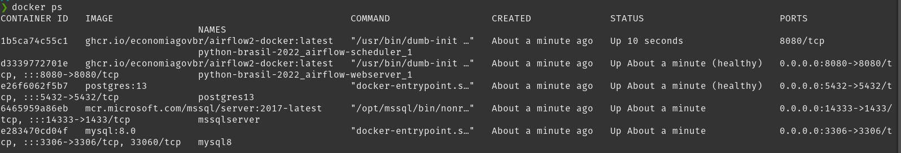
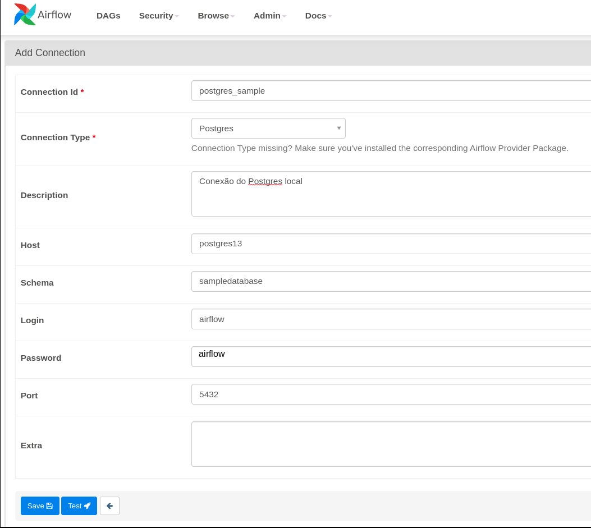
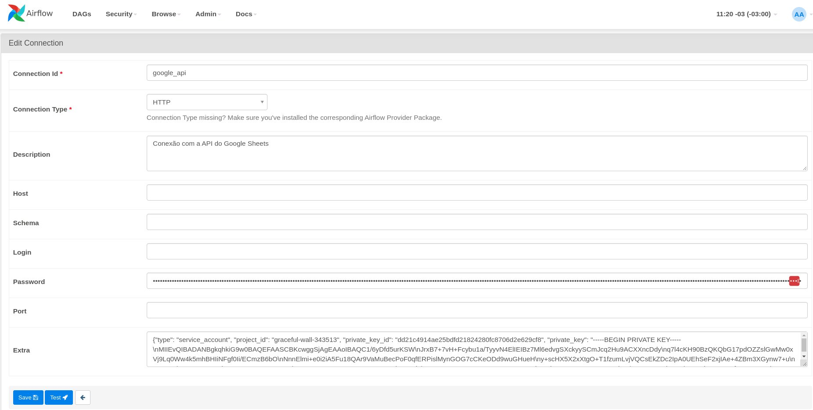

# **FastETL, um pacote ETL para Airflow simples e prático**

  

Olá! Neste repositório estão os códigos e instruções da instalação e configuração do ambiente Airflow2 + FastETL para o evento a ser apresentado no **Python Brasil 2022 - FastETL, um pacote ETL para Airflow simples e prático**

  

Este ambiente utiliza a versão do Airflow mantida pela equipe da SEGES/ME, com módulos e bibliotecas extras do python, além da extensão FastETL.

  

Link da apresentação: https://docs.google.com/presentation/d/1X0pofeozy5w7ud0AsZWmZnjN4MwhuiI_60P28gE90vo/

  

## Preparação e execução do Airflow

1. Instalar Docker CE [aqui!](https://docs.docker.com/get-docker/)

Obs.: É necessário que o `docker-compose` tenha versão mínima 1.29. No Ubuntu 20.04, recomenda-se instalar o docker a partir do gerenciador de pacotes _snap_:

  

>  `snap install docker`

  

2. Clonar o repositório (https://github.com/economiagovbr/python-brasil-2022.git) na máquina

  

> git clone https://github.com/economiagovbr/python-brasil-2022.git

  

3. Importar o repositório do FastETL (https://github.com/economiagovbr/python-brasil-2022.git) dentro da pasta do repositório python-brasil-2022. Este plugin é contém algoritmos e extensões do Airflow inventados pela equipe para realizar tarefas repetitivas dentro das DAGs, como a **carga** de uma tabela entre BDs ou a **carga de uma planilha do google** em uma tabela no datalake.

  

> cd python-brasil-2022

> git clone https://github.com/economiagovbr/FastETL.git

  

4. No Linux, os volumes montados no contêiner usam as permissões de usuário / grupo do sistema de arquivos Linux nativo, portanto, você deve certificar-se de que o contêiner e o computador host têm permissões de arquivo correspondentes.

  

>  `echo -e "AIRFLOW_UID=$(id -u)\nAIRFLOW_GID=0" > .env`

  

5. Dentro da pasta clonada (na raiz do arquivo Dockerfile), executar o comando para gerar a estrutura do banco do airflow local (Postgres)

  

> docker-compose up airflow-init

  

Se o docker build retornar a mensagem `error checking context: 'can't stat '/home/<user-linux>/.../mnt/pgdata''.`, então executar:

  

> sudo chown -R <user-linux> mnt/pgdata

  

6. Para subir o Airflow execute:

> docker-compose up

ou (-d para rodar em background)

> docker-compose up -d

  

7. O arquivo do docker-compose além do airflow prevê três instâncias de banco de dados: Postgres, MSSQL e MYSQL. Conferir se todas as instâncias estão rodando.

  

> docker ps

  

8. A partir deste momento, o airflow deve estar acessível pelo navegador. Acesse o Airflow em [http://localhost:8080/](http://localhost:8080/)

  

9. As DAGs devem ser criadas na pasta dags/

  
  

## Criação dos databases de exemplo

Para podermos ver o Operador DbToDbOperator em ação, precisamos criar, a partir dos templates da pasta database_samples/, os databases com tabelas de exemplo para os SGBDs MYSQL, MSSQL e PostgreSQL.

Esses datasets contém dados fictícios gerados através da plataforma [mockaroo.com](https://mockaroo.com)

1. Instalar o DBeaver Community para consultas à base de dados.

  

* Caso não seja possível instalar o DBeaver, as consultas SQLs podem ser feitas acessando o container e executando as interfaces CLI dos SGBDs, exemplo *mysql, psql ou sqlcmd*.

  

> sudo snap install dbeaver-ce

  

2. Na pasta raiz, executar o script de CREATE database e CREATE tables:

  

> ./init_databases.sh

  

3. Abrir o DBeaver CE e importar as conexões.

  

> dbeaver-ce

  

File -> Importar -> DBeaver -> Projetos -> Avançar

Selecione o arquivo database_samples/Python Brasil 2022.dbp

Caso seja necessário instalar o driver de conexão, confirmar.

  

4. No DBeaver CE verificar em cada instância do projeto se o banco de dados de nome *sampledatabase* e as tabelas *People e Movie* foram criadas (no PostgreSQL somente a tabela *People*). De início, somente as tabelas do banco MYSQL estarão populadas com dados.

  

5. Criar as conexões no Airflow. Menu **Admin > Connections > Add a new record**

* O host deve ser o nome do container, como configurado no docker-compose.yml

### MySQL

  

### MSSQL

  

### PostgreSQL

  

6. Rodar a DAG **copydbtodb_test** ou **copydbtodb_multiple_tables_test** e verificar no Dbeaver se os dados foram replicados.

  

## Configuração do Google API

O operador LoadGSheetOperator é um operador para o airflow responsável por gravar dados de uma planilha do google sheets para uma tabela de um banco do SQL Server.

  

Para podermos ver o operador LoadGSheetOperator em ação, precisamos configurar as credenciais do Google API no airflow. Pode-se copiar e colar o conteúdo do arquivo **google-api.json**, na pasta *conf/google-api.json*.

  

Se preferir, pode-se criar as próprias credenciais para conta de serviço de acesso à API (https://console.cloud.google.com/).

  

1. Criar a conexão do Google API no Airflow. Menu **Admin > Connections > Add a new record**

* Colar o conteúdo do JSON no campo password e Extra

  

2. No arquivo **load_gsheet_dag.py**, incluir na constante GSHEET_METADATA os metadados de uma planilha do Google Sheets.

3. Rodar a DAG **load_gsheet_dag** e verificar no DBeaver, no banco sampledatabase do MSSQL, se a tabela foi criada e populada com os mesmos dados da planilha Google.

  

## Para desligar o ambiente Airflow

Na pasta raiz do projeto:

  

> docker-compose down